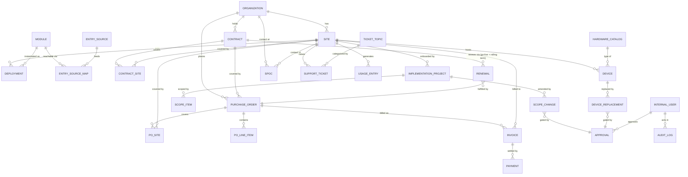

# Hipla Customer Hub — Build Specification

**Document type:** Architecture + Data Model + Functional Specification (a single source of truth for the build)
**Audience:** (1) the human engineer who will lay down CI/CD, infrastructure, architecture, and schema; (2) the AI coding agent (Claude) that will implement the application.
**Status:** v1 design brief. This is a *rethink* of an existing Emergent-built prototype, not a port of it. Where this document and the prototype disagree, this document wins.
**Owner:** Priyanka (Business Head, Hipla / HBI Solutions Pvt. Ltd.)

---

## 0. How to read this document

This is written for two readers at once.

- **The engineer** should focus on §7 (Architecture & Infrastructure), §8 (CI/CD & Environments), §9 (Security, Auth & Audit), §10 (Non-functional requirements), and §11 (Build plan / milestones). The schema in §6 is what your migrations and RLS policies must implement.
- **The coding agent** should treat §3–§6 as the contract for *what to build*, §11 as the order to build it in, and §12 as the rules of engagement (conventions, guardrails, what to confirm before guessing). Do not invent business rules that aren't here — flag them in §13 instead.

A short glossary up front, because the words "customer," "PO," and "renewal" are overloaded in the prototype:

| Term | Meaning in this document |
|---|---|
| **Organization** | The enterprise / HQ. The top of the customer tree. Has one or more Sites. |
| **Site** | A single office/location of an Organization. **This is where almost all operational data lives** — config, contracts, POs, invoices, devices, usage, tickets. The HQ is itself a Site. |
| **Module** | A purchasable Hipla product capability (VMS with host, MRM, Pantry, etc.). Catalog-managed. |
| **Deployment** | An instance of a Module live at a specific Site, with its own configuration. |
| **Contract** | A commercial term/subscription for a Site (the thing that *renews*). |
| **PO** | A purchase order — a customer's commitment to pay. Sits under a Site/Contract. |
| **Invoice** | A demand for payment Hipla raises against a PO/Contract. Has its own aging. |
| **Renewal** | A lifecycle event on a Contract, not a type of PO. |
| **SPOC** | A named customer contact with a role (decision maker, approver, etc.). |
| **Internal user** | A Hipla team member who uses the Hub (Priyanka, Arpita, onboarding, support). |

---

## 1. What the product is

An **internal** operations console for Hipla's customer-success, onboarding, and commercial teams. It is not customer-facing. When a sales order lands, the Hub runs the customer end-to-end: implementation → go-live → usage → support → renewals, while keeping the commercial truth (POs, invoices, collections, renewals) and the operational truth (devices, scope, SPOCs) in one place.

The single most important user journey: **open any Site and see its entire story** — where it is, who the contacts are, what modules are live, what hardware is installed, what's been invoiced and collected, what's pending, when it renews, and what's in flight (implementation, scope changes, tickets, device swaps).

The second journey: **a portfolio dashboard** — upcoming renewals, money collected, money pending, and implementation projects by status (in progress / due / done) across the whole book of business.

### Hipla's product catalog (modules)

The five headline products are Visitor Management, Meeting Room Schedulers, Access Control, Pantry Management, and Attendance Management. In practice the catalog is more granular (the prototype carries nine). Treat modules as **configurable reference data**, seeded with:

`VMS with host`, `VMS without host`, `Meeting Room Management (MRM)`, `Pantry`, `Access Control`, `Attendance`, `Digital Signage`, `Scheduler`, `Phone Booth Management`, `Real Estate VMS`.

### The customer shape (this is the crux)

Customers are enterprises with a **parent (HQ) → child (office/location)** structure. The HQ buys, then rolls the solution out to other offices. Critically: **billing, product configuration, agreements, payment terms, and even how the system is used all differ per location.** A flat "Customer" record cannot represent this, which is the prototype's central weakness (see §3).

---

## 2. Scope (v1)

**In scope:** Organization/Site hierarchy; module & deployment config per Site; implementation projects with custom scope; SPOCs; commercials (Contracts, POs, Invoices, Payments, Renewals); hardware/device inventory with Esper IDs and replacement; scope changes with approval; support tickets (synced + manual) with topic breakdown; usage tracking; the Site 360 view; the portfolio dashboard; settings/catalogs (modules, entry sources, hardware).

**Out of scope (v1), but design must not preclude:** a customer-facing portal; automated billing/GST e-invoicing generation; deep two-way CRM sync; predictive renewal/churn scoring; mobile apps.

---

## 3. What we are changing from the prototype, and why

The prototype (built in Emergent) got a lot of the *vocabulary* right — modules, entry sources, hardware catalog, the 5-stage implementation idea, role-based SPOCs, Esper-ID device tracking. Keep that vocabulary. The structure underneath it needs rework. Concretely:

1. **Introduce the Organization → Site hierarchy as the spine.** The prototype treats "Customer" as flat, so it has no place to express "same logo, different billing/config/usage per office." Almost every operational entity must hang off **Site**, with the Organization as a roll-up for reporting. *This is the highest-priority change.*

2. **Stop conflating PO, payment, and renewal.** The prototype's "PO & Payment Management" mixes the purchase order, the cash received, and the Year 2–5 renewal projection into one screen. Split them: `Contract` (the thing that renews) → `PurchaseOrder` (a commitment) → `Invoice` (a demand) → `Payment` (cash). A **Renewal** is an event on the Contract, not a PO subtype. This is what makes "pending collection" and "upcoming renewals" computable rather than hand-maintained.

3. **Add a real Invoice entity.** The requirements explicitly ask for invoice tracking — *due, cleared, amount* — but the prototype has no invoice object; it tracks a single "payment received date" on the PO. Invoices need their own amount, due date, GST, and an aging status that feeds the dashboard's "pending collection."

4. **Make implementation scope first-class and editable.** You asked for "customise scope writing for the one who creates the implementation project." In the prototype, scope is a free-text box buried in Stage 1. Promote scope to a structured, editable checklist of **ScopeItems** per project, seeded from the modules purchased but fully editable by the implementer, and version-linked to Scope Changes (point 7). Keep the 5 stages, but as a **configurable template**, not hardcoded UI.

5. **Model devices as physical units with a lifecycle, not rows in a form.** Each device is one record with an Esper ID and a status (`active → replaced / RMA / retired`). A replacement is an **event** that links the outgoing unit to the incoming one and preserves history, rather than overwriting. The prototype's replace flow is close; it just needs to persist history and not lose the old unit.

6. **Add Support Tickets** (absent from the prototype screenshots but in your requirements). Tickets belong to a Site, carry a **topic/category** so "tickets by topic" is a real aggregation, and should **sync from your helpdesk** (you already run Zoho) with a manual-entry fallback.

7. **Generalize approvals.** Both Scope Changes and Device Replacement need sign-off. The prototype implements an ad-hoc approver dropdown + 6-digit OTP on scope changes only. Extract one **Approval** primitive (approver = an internal Hipla user, with an optional OTP/verification step) and reuse it. *Decision needed:* is the approver always internal? The replacement screen lists internal names (Sandeep Kaul, Priyanka Shinde, Aryan Raj, Arpita Roy), so v1 assumes **internal approver**. Flagged in §13.

8. **Treat usage as ingested data with a manual fallback, not a weekly data-entry chore.** The prototype makes someone hand-key weekly entry counts per module/source. That won't scale and won't stay current. Define a thin **usage ingestion** boundary (API push or CSV import from each product), and keep manual entry only as a fallback. The "expected vs actual / usage category" logic stays.

9. **Keep Settings/catalogs — they were good.** Modules, Entry Sources (with module mappings), and the Hardware catalog (Tablet / Mount / Accessory) are genuinely useful reference data. Port them as configurable tables and seed them (Appendix A).

Everything else below assumes these nine changes.

---

## 4. Design principles

- **The Hub is configurable end-to-end — no business reference data is hardcoded.** Modules/products, entry sources, hardware, ticket topics, cost types, PO types, payment terms, scope-item categories, stage templates, term lengths, and usage expectations are all **admin-managed catalogs editable in Settings, without a deploy.** An admin can add a new product (e.g. a new VMS variant) at any time and it immediately becomes selectable everywhere it's relevant. The VMS variants and Attendance are *seed entries* in the Module catalog, not fixed code.
- **Site is the unit of operations; the Organization is the unit of roll-up.** Operational data (config, devices, usage, tickets, invoices, implementation) is always site-scoped. Commercial commitments (Contracts, POs) may sit at one Site or cover several. The Org 360 rolls up all child Sites; the Site 360 shows only that Site. When in doubt where an *operational* field lives, it lives on the Site.
- **Money is computed, never hand-totaled.** Collected, pending, projected, and deviation figures are derived from Invoices/Payments/Contracts at query time. No stored running totals that can drift.
- **Everything commercial or approval-bearing is auditable.** Who created it, who approved it, when, and what changed. Append-only audit log.
- **Reference data is configurable, not hardcoded.** Modules, sources, hardware, ticket topics, scope templates, cost types, PO types — all editable in Settings.
- **Attachments are first-class.** POs, quotations, handover notes, site photos, proof-of-schedule — every such field is a file reference with metadata, stored in object storage, never a blob in a text column.
- **Soft-delete and history over destructive edits.** Especially devices, contracts, scope, and approvals.

---

## 5. Functional specification (module by module)

### 5.1 Customer hierarchy (Organization & Site)

- **Organization**: legal/brand entity. Fields: legal name, brand/display name, industry, logo, primary domain, notes, owner (internal account manager), status (`prospect / active / churned`).
- **Site**: an office of an Organization. Fields: site name, organization (FK), is-HQ flag, addresses (**site/physical**, **billing**, **shipping** — three distinct addresses, since they differ per location), GST number, region, timezone, status (`prospect / implementing / live / suspended / churned`), assigned onboarding owner, assigned CS owner, **go-live date** (the renewal anchor — see §5.4).
- **Site-scoped data (always belongs to exactly one Site):** Deployments/config, Invoices, Payments, Devices, Support Tickets, Usage, Implementation Projects, Scope Changes, site-level SPOCs. These are the per-location things that differ between offices.
- **Org-or-site data (may sit at one Site *or* cover several Sites):** Contracts and Purchase Orders — because HQ sometimes buys centrally and rolls out to multiple offices, and sometimes each office buys on its own. See §5.4.
- **Two primary views:**
  - **Site 360** — strictly that Site's slice: its config/modules, POs and contracts touching it, invoicing, collections, usage, devices, tickets, SPOCs. Nothing from sibling Sites leaks in.
  - **Organization 360** — a roll-up across all child Sites: a list of children (each linkable to its Site 360) plus aggregated commercials (all POs/contracts/invoices/collections/renewals), total revenue, total pending collection, and portfolio counts. This is what you see when you "click on the parent."

### 5.2 Modules, Entry Sources & Deployments

- **Module catalog** (Settings): seeded list in §1; each has name, short code, description, active flag.
- **Entry Source catalog** (Settings): the channels through which entries enter a module (VMS Tab, Outlook, Google, Dashboard/app, QuickBook, Order Placing Tab, App, Authenticator, Slack, Notion). Each source maps to one or more modules (Appendix A has the mapping).
- **Deployment**: a Module live at a Site, with per-site config: enabled entry sources, host/no-host flavor, config notes, status (`planned / configuring / live / paused`). This is what differs per location.

### 5.3 Implementation projects

- An **ImplementationProject** belongs to a Site. Fields: name, modules in scope (from purchased modules), owner (internal), current stage, status (`not started / in progress / due / blocked / done`), expected delivery date, live date.
- **Stages** come from a **configurable StageTemplate** (default = the 5 below). Each stage is a set of typed checklist items (boolean / select / text / file / date / multi-file). Seed the default template from the prototype:
  1. **Sales Order** — modules purchased (multi-select), hardware-by-customer, hardware-by-Hipla, final quotation (file), PO attachment (file), payment terms, site address, SPOC, connected-to-onboarding-team, expected delivery date.
  2. **Establish Contact** — welcome email w/ credentials sent (y/n), schedule-to-visit discussed (y/n), proof of schedule (file), connected-with-customer-on-call (y/n).
  3. **Hardware Provision** — hardware provided to customer (links to Device records), welcome flyer requested from designer (y/n), welcome flyer sent (y/n).
  4. **Customer Onboarding** — hardware-installed confirmation (file), training confirmation (file), scope-configured % + pending items (text), live site pictures (multi-file).
  5. **Customer Success Handover** — sales scope signoff after go-live (text), customer handover note (file). Completing this sets the Site/Deployment to `live` and stamps the **go-live date** (which seeds renewal math, see §5.4).
- **Scope is first-class.** A project has a list of **ScopeItems** (title, description, module, status `planned / configured / pending / dropped`, owner). Seed from purchased modules; the implementer edits freely ("customise scope writing"). The Onboarding stage's "scope configured %" is *computed* from ScopeItem statuses, not typed. ScopeItems are the baseline that Scope Changes (§5.7) amend.

### 5.4 Commercials — Contracts, POs, Invoices, Payments, Renewals

This replaces the prototype's single "PO & Payment Management" screen with a clean chain.

- **Contract**: belongs to an **Organization**, with a **covered-Sites** list (1..N — a join table). When it covers exactly one Site it behaves as a site-level contract; when it covers several it's a central/HQ contract that appears in the Org 360 and in each covered Site's 360. Fields: contract number, modules covered, **go-live anchor date**, **initial term length** (`1 / 3 / 5 years`, configurable), ACV (ex-tax), billing frequency, payment terms (e.g. `Net 30`, `50% advance`), auto-computed **renewal date**, status (`active / expiring / renewed / churned`). A Contract is **the thing that renews**.
  - **Renewal date basis (confirmed by example):** the renewal anchors to the **go-live date**, not the order/contract-signing date. `first_renewal_date = go_live_date + initial_term`. Each subsequent cycle rolls forward by *that cycle's* renewal term, which may differ from the initial term — e.g. a 3-year initial order renews 3 years after go-live, and could then renew in 1-year cycles. So each **Renewal** record carries its own term, and `next_renewal_date = previous_renewal_date + that_renewal's_term`.
  - For a single-Site contract, the go-live anchor = that Site's go-live date. For a multi-Site contract where offices go live on different dates, the contract carries its **own** go-live anchor (default = the primary/first Site's go-live), so renewal is unambiguous; per-Site technical go-live is still tracked on each Site for implementation.
- **PurchaseOrder**: belongs to an **Organization**, with a **covered-Sites** list (1..N), optionally linked to a Contract. Same single-vs-multi-Site behavior as Contract. Fields: PO number (system code + customer PO ref), PO type (`New / New-on-agreement / New-on-invoice / Renewal / Renewal-on-agreement / Renewal-on-invoice`), cost type (catalog), module(s), financial year, PO received date, PO value (ex-tax), GST %, PO attachment (file), payment terms, line items (**POLineItem**: description, qty, unit price, amount). PO value is the **sum of line items** (computed), not a free number.
- **Invoice**: raised against a PO/Contract and tied to **exactly one billed Site** (so per-Site collection rollups always work, even when the parent PO covers several Sites — a central PO can produce one HQ invoice or one invoice per Site). Fields: invoice number, billed Site (FK), amount (ex-tax), **GST number** (recorded, not computed), **GST amount** (entered, not computed), total, issue date, **due date**, status (`draft / raised / due / overdue / part-paid / cleared / cancelled`), attachment. Status is derived from payments + due date (overdue = unpaid past due). The Hub **records** tax figures as input fields — it does **not** compute GST or generate e-invoices in v1. **This is the object that powers "invoice due / cleared / amount" and "pending collection."**
- **Payment**: cash received against an invoice. Fields: amount, received date, mode, reference. An invoice is `cleared` when payments ≥ total.
- **Renewal**: an event on a Contract. Fields: due date (= prior anchor + this cycle's term), **renewal term** (this cycle's length), expected value (projection from current contract/commercials), actual renewal PO (FK, once raised), renewal received date, actual value, **deviation %** (computed: actual vs expected), status (`upcoming / in-progress / renewed / lost`). The prototype's "Year 2–5 projections w/ deviation" becomes a forward series of Renewal rows generated from go-live + the rolling terms.

> **Why this matters for the dashboard:** with these objects, "upcoming renewals," "collected," and "pending collection" are all single queries (§6). In the prototype they were manual fields that go stale.

### 5.5 Hardware & Devices

- **HardwareCatalog** (Settings): the buyable items, categorized `Tablet / Mount / Accessory` (Appendix A, 27 seed items). Fields: name, category, active.
- **Device**: a physical unit at a Site. Fields: hardware (FK to catalog), **Esper ID**, **name on Esper**, serial (optional), deployment/module it serves, status (`active / replaced / RMA / retired`), provided date, provided-by (`customer / Hipla`). One row per physical unit.
- **DeviceReplacement**: an event. Fields: outgoing device (FK), incoming device (new Device record), reason, approver (Approval, §5.8), replaced date. The outgoing device flips to `replaced`; the incoming is `active`; history is preserved. Dashboard counts of "active vs replaced" are computed from Device.status.

### 5.6 SPOCs (customer contacts)

- **SPOC**: belongs to an Organization or a Site (allow both — some contacts are HQ-wide, some site-specific). Fields: name, email, phone, designation, **role** (`Decision maker / Solution approver / Middle user-manager / End user`), has-taken-Hipla-training (bool), notes. SPOCs are selectable as e.g. the "SPOC address" in implementation, and are distinct from internal approvers.

### 5.7 Scope Changes

- **ScopeChange**: belongs to an ImplementationProject (or Site post-go-live). Fields: description, date, impact (e.g. "Timeline +2 weeks"), affected ScopeItems (optional links), approval (Approval, §5.8), status (`pending / approved / rejected / applied`). On approval+apply, it amends the ScopeItem baseline (creating an auditable diff). Timeline shows all changes chronologically.

### 5.8 Approvals (shared primitive)

- **Approval**: reusable across ScopeChange and DeviceReplacement (and future flows). Fields: approver (internal user FK), method (`manual / otp`), status (`pending / approved / rejected`), requested-by, requested-at, decided-at, verification token (if OTP). "Submit & notify approver" sends an email; OTP (if enabled) is verified before the action commits. *Approver = internal Hipla user in v1 (see §13).*

### 5.9 Support Tickets

- **SupportTicket**: belongs to a Site. Fields: external ref (from helpdesk), subject, **topic/category** (catalog: e.g. Hardware, Configuration, Access/Login, Training, Billing, Feature Request, Bug, Other), status (`open / pending / resolved / closed`), priority, opened date, resolved date, source (`imported / manual`), module (optional). Primary source is **CSV import** (export from Zoho/your helpdesk → upload into the Hub); manual entry is the fallback. No live two-way sync in v1. Powers "total tickets" and "tickets by topic."

### 5.10 Usage tracking

- **UsageEntry**: per Site + Module + EntrySource + period (year, month, week 1–5), count of entries, notes, source (`imported / manual`). Primary ingestion is **CSV import** (export usage counts from each product → upload into the Hub); manual entry remains for gaps. No live API push in v1, but the import boundary should be a clean, well-typed contract so an API push can be added later without reshaping the data.
- **Derived usage health** per Deployment: expected entries/week (configurable per module), actual (sum of UsageEntry), and a **usage category** (`No Usage / Low / Healthy / Heavy`) by comparing actual vs expected. Drives a "who's not using what they bought" signal (renewal risk).

---

## 6. The dashboard & reporting

All metrics are **computed queries**, scoped optionally by Organization, owner, region, or date range.

| Metric | Definition |
|---|---|
| **Upcoming renewals** | Contracts/Renewals with due date in next 30/60/90 days, with expected value. |
| **Collected (period)** | Σ Payments.amount where received date in period. |
| **Pending collection** | Σ (Invoice.total − payments) where status ∈ {due, overdue, part-paid}. Split overdue vs not-yet-due. |
| **Implementation pipeline** | Count of ImplementationProjects by status: in progress / due (past expected delivery, not done) / done. |
| **Revenue by customer** | Σ cleared invoice totals (or ACV), grouped by Organization → Site. |
| **At-risk renewals** | Upcoming renewals where the Site's usage category is `No Usage` or `Low`. |
| **Device health** | Active vs replaced/RMA counts; sites with open replacements. |
| **Tickets by topic** | Count of SupportTickets grouped by topic, filterable by Site/period. |

Dashboard surfaces these as cards + drill-down lists. Every card links to the filtered list, every list row links to the Site 360.

---

## 7. Architecture & infrastructure (for the engineer)

### 7.1 Recommended stack

This matches the direction you've already been evaluating and is the lowest-risk path to a maintainable rebuild:

- **Frontend + API:** Next.js (App Router) + TypeScript, deployed on **Vercel**. Server Components + Route Handlers / Server Actions for the API surface. UI: Tailwind + a component library (shadcn/ui).
- **Database + platform:** **Supabase** (managed Postgres) for DB, **Auth**, **Storage** (attachments/photos), and **Row-Level Security**. Postgres is the right call because the whole model is relational and the dashboard is aggregation-heavy.
- **ORM / migrations:** Prisma or Drizzle (Drizzle if you want SQL-first and tight control of RLS-friendly queries; Prisma if you want speed of development). Either way, **migrations live in the repo** and are the source of truth for schema.
- **Background work:** Vercel Cron (or Supabase scheduled functions) for: invoice aging recompute, renewal-date generation, usage health rollups, helpdesk sync.
- **Email/notifications:** a transactional provider (Resend/SendGrid) for approval notifications and OTP.

**Alternatives** if the team prefers: a dedicated backend (NestJS/FastAPI) + Postgres on a VPS/Render, with the same schema. The schema and functional spec are stack-agnostic; only §7/§8 change.

### 7.2 Why this shape

Single internal tenant, modest user count (Hipla's team), relational data, heavy reporting, and a need to move fast → a Postgres-backed Next.js app on managed infra gives the best effort-to-value ratio and avoids ops overhead. The prototype's pain (breaks on deploy) is exactly what managed build/deploy on Vercel + migration-driven schema is meant to remove.

---

## 8. CI/CD & environments

- **Environments:** `local` → `preview` (per-PR, Vercel preview deploys) → `staging` → `production`. Each maps to its own Supabase project (or schema) so migrations are tested before prod.
- **Source control:** trunk-based with short-lived PRs. `main` is always deployable.
- **Pipeline (GitHub Actions or Vercel-native):** on PR → typecheck, lint, unit tests, build, run migrations against an ephemeral DB, run integration tests, deploy preview. On merge to `main` → migrate staging, run smoke tests, then promote to production (manual approval gate for prod migrations).
- **Migrations:** forward-only, reviewed, never edited after merge. Destructive migrations require explicit sign-off.
- **Secrets:** in Vercel/Supabase env config, never in the repo. Separate keys per environment.
- **Backups:** Supabase automated daily backups + point-in-time recovery on prod. Attachments in Storage with versioning.
- **Observability:** error tracking (Sentry), structured logs, uptime check on the dashboard route.

---

## 9. Security, auth, roles & audit

- **Auth:** Supabase Auth, restricted to Hipla email domain. Internal users only — no customer login in v1.
- **Roles:** `admin` (settings, user management, destructive actions), `manager` (full operational + commercials + approvals), `cs/onboarding` (operational, limited commercials), `read-only` (dashboard + 360, no edits). Approvals (§5.8) require `manager`/`admin`.
- **RLS:** even though single-tenant, enforce row-level policies so role restrictions are DB-enforced, not just UI. Service-role keys only in server context.
- **Audit log:** append-only table capturing actor, action, entity, before/after (for commercials, scope, devices, approvals). Surfaced as a timeline on relevant records.
- **Attachments:** signed URLs, access-controlled via Storage policies. No public buckets.
- **OTP:** time-boxed, single-use, rate-limited; stored hashed.
- **PII:** SPOC and payment data treated as sensitive; least-privilege access; aligns with your DPDP posture.

---

## 10. Non-functional requirements

- **Performance:** Site 360 loads < 1.5s p95; dashboard aggregations < 2s p95 (use indexed views/materialized rollups for the heavy metrics).
- **Data integrity:** computed money fields never stored as denormalized totals that can drift; use DB-level constraints and generated columns where possible.
- **Auditability:** every commercial/approval mutation logged.
- **Configurability:** all catalogs editable without a deploy.
- **Accessibility & responsiveness:** desktop-first (it's an ops console) but usable on tablet.

---

## 11. Build plan / milestones (the order to build in)

Build in vertical slices; each milestone ends with something usable and tested.

1. **Foundation:** repo, CI/CD, Supabase, auth, roles, RLS scaffolding, base layout, audit-log primitive.
2. **Hierarchy + Settings:** Organization, Site (with 3 addresses), and the catalogs (Modules, Entry Sources + mappings, Hardware, Cost Types, PO Types, Ticket Topics, Term Lengths). Seed from Appendix A. Build both the **Site 360 shell** and the **Organization 360 shell** (child list + roll-up placeholders).
3. **Commercials core:** Contract → PO (both Org-owned with a covered-Sites list, 1..N) → POLineItem → Invoice (billed to one Site) → Payment, with computed PO value, invoice aging, and the money metrics rolling up correctly at both Site and Org level. This unblocks the most valuable dashboard cards.
4. **Renewals:** generate the Renewal series from **go-live + rolling per-cycle terms**; expected value + deviation.
5. **Implementation + Scope:** StageTemplate, ImplementationProject, ScopeItem (editable scope), computed scope %, attachments. Go-live stamps the Site.
6. **Hardware & Devices:** catalog-backed Device records, Esper fields, lifecycle, DeviceReplacement with the shared Approval primitive.
7. **SPOCs & Scope Changes:** SPOC management; ScopeChange with Approval + OTP; change timeline amending the ScopeItem baseline.
8. **Support tickets:** topic taxonomy (configurable), manual entry + **CSV import** (Zoho/helpdesk export → upload). No live sync in v1.
9. **Usage:** **CSV import** boundary (well-typed contract) + manual fallback, usage-health categorization, at-risk-renewal signal.
10. **Dashboard:** all §6 metrics with drill-downs, then polish, perf passes, and rollup materialization.

Ship 1–3 first; they deliver the "open a Site, see commercials + collections" value on their own.

---

## 12. Instructions for the coding agent (rules of engagement)

- **Build from §6 (schema) and §5 (behavior); follow §11's order.** Do vertical slices, not horizontal layers — each milestone should run end-to-end.
- **Do not invent business rules.** If a rule is ambiguous (e.g. how renewal date is derived, whether an approver can be a customer), do **not** guess silently — implement the v1 assumption noted here and leave a `// DECISION:` comment referencing §13, and list it in your hand-off notes.
- **Reference data is data, not code.** Never hardcode module names, hardware items, PO types, or topics in components — read them from the catalog tables (seeded from Appendix A).
- **Money is computed.** Never store a total that can be derived from line items / payments. Use generated columns or query-time aggregation. Currency is INR; store amounts in the smallest unit (paise) as integers to avoid float drift.
- **Everything mutating commercials, scope, devices, or approvals writes an audit entry.** No exceptions.
- **Attachments go to Storage** with a metadata row; never base64 into the DB.
- **Migrations are the schema.** Every model change is a reviewed migration; keep the seed script idempotent.
- **Write tests for the money math and the aging/renewal/deviation logic first** — these are the rules most likely to be wrong and most expensive if they are.
- **Confirm before destructive operations** in generated UI (deletes are soft by default).
- **Keep the Site 360 and the dashboard fast** — index foreign keys and date columns; consider materialized rollups for dashboard metrics from the start.

---

## 13. Resolved decisions (confirmed with Priyanka)

All of the following are now locked. The build should treat them as fixed.

1. **Renewal date basis — RESOLVED (anchored to go-live).** The renewal anchors to the **go-live date**, not the order/signing date. `first_renewal = go_live + initial_term`; each later cycle rolls forward by *that cycle's* renewal term (which may differ — a 3-year initial order can renew in 1-year cycles). Examples confirmed: an annual order renews one year after go-live; a 3-year order renews three years after go-live. Each Renewal row carries its own term.
2. **Approver identity — RESOLVED.** Always an **internal Hipla user**. No customer-approver branch needed; the Approval primitive stays internal-only.
3. **OTP purpose — RESOLVED.** It is an **internal two-person control**, delivered to the internal approver — not a customer sign-off.
4. **SPOC scope — RESOLVED.** SPOCs attach to **both** Organization and Site.
5. **Usage ingestion — RESOLVED.** **CSV import** (per Site/Module/Source/period) + manual fallback. No live API push in v1; keep the import contract clean so one can be added later.
6. **Helpdesk source — RESOLVED.** Tickets also come via **CSV import** (Zoho export → upload) + manual entry. No live or two-way sync in v1.
7. **GST — RESOLVED.** **Record only.** Provide GST number + GST amount as input fields on the Invoice (and GST number on the Site). The Hub does not compute GST or generate e-invoices.
8. **Module/product catalog — RESOLVED.** Fully **configurable**. The VMS variants and Attendance are seed entries in the Module catalog, not hardcoded. An admin can add any product at any time; the entire Hub is catalog-driven (see Design Principle #1 in §4).
9. **Central (HQ) vs per-Site purchasing — RESOLVED (both patterns).** A Contract/PO is owned by the **Organization** and carries a **covered-Sites list (1..N)**: one Site = a normal site-level deal; many Sites = a central/HQ deal rolled out to children. **Click the parent → Organization 360** shows all child Sites plus aggregated POs/contracts/invoicing/renewals. **Click a child → Site 360** shows only that Site's POs, contracts, invoicing, usage, config/modules — never a sibling's. Invoices are always tied to one billed Site so collections roll up cleanly at both levels.

**No remaining open decisions.** The spec is build-ready. Anything that surfaces during the build that isn't covered here should be raised rather than guessed (per §12).

---

## Appendix A — Seed reference data (from the prototype, verified against screenshots)

### A.1 Modules (seed)
`VMS with host`, `VMS without host`, `Meeting Room Management (MRM)`, `Pantry`, `Access Control`, `Attendance`, `Digital Signage`, `Scheduler`, `Phone Booth Management`, `Real Estate VMS`.

### A.2 Entry sources → module mappings (seed)
| Entry source | Maps to modules |
|---|---|
| VMS Tab | VMS with host, VMS without host |
| Outlook | VMS with host, VMS without host, MRM, Pantry |
| Google | VMS with host, VMS without host, MRM, Pantry |
| Dashboard/app | VMS with host, VMS without host, MRM, Pantry |
| QuickBook | MRM, Pantry |
| Order Placing Tab | Pantry |
| App | Pantry |
| Authenticator | Access Control |
| Slack Integration | VMS with host, VMS without host |
| Notion | VMS w/ host, VMS w/o host, MRM, Pantry, Access Control, Digital Signage, Scheduler |

### A.3 Hardware catalog (seed, 27 items)
- **Tablet (9):** Lenovo M10, Samsung Galaxy A9 plus, Samsung Galaxy A8, Lenovo M8, Lenovo M7, Hipla Meeting LED Schedulers, Lenovo Tab V7, Samsung F05, Samsung Galaxy A11+ 5G.
- **Mount (5):** Silver Mount, Black Mount, Lumi Mount, Standard Mount, Wall Mount.
- **Accessory (13):** D-Link Power Supply, Sonoff, Samsung Adaptor, Lenovo Adaptor, Electro Magnetic Lock, Exit Switch, Gangbox Adaptor for Sonoff, Thermal Brother Printer, Printer Rolls, Airtel SIM card, RFID Cards, RFID Reader, Tablet Cover.

### A.4 PO types (seed)
`New PO`, `New PO on agreement`, `New PO on invoice`, `Renewal PO`, `Renewal on agreement`, `Renewal on invoice`. Plus a configurable **Cost Type** catalog.

### A.5 SPOC roles (seed)
`Decision maker`, `Solution approver`, `Middle user/manager`, `End user`.

### A.6 Support ticket topics (proposed seed)
`Hardware`, `Configuration`, `Access / Login`, `Training`, `Billing`, `Feature Request`, `Bug`, `Integration`, `Other`.

### A.7 Implementation stage template (default)
Stage 1 Sales Order · Stage 2 Establish Contact · Stage 3 Hardware Provision · Stage 4 Customer Onboarding · Stage 5 Customer Success Handover (fields per §5.3).

---

## Appendix B — Entity relationship overview

---

*End of specification. §13 is fully resolved — no open decisions remain. The spec is build-ready; per §12, anything not covered here should be raised during the build rather than guessed.*
